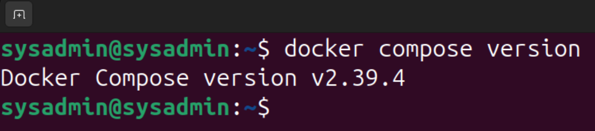
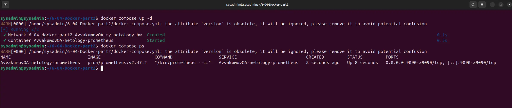
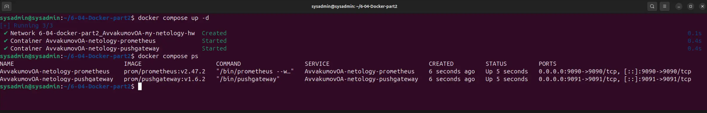
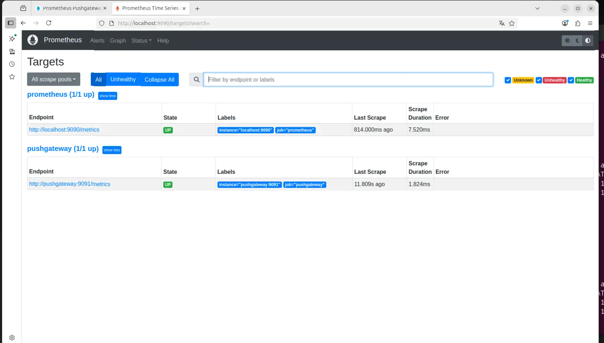
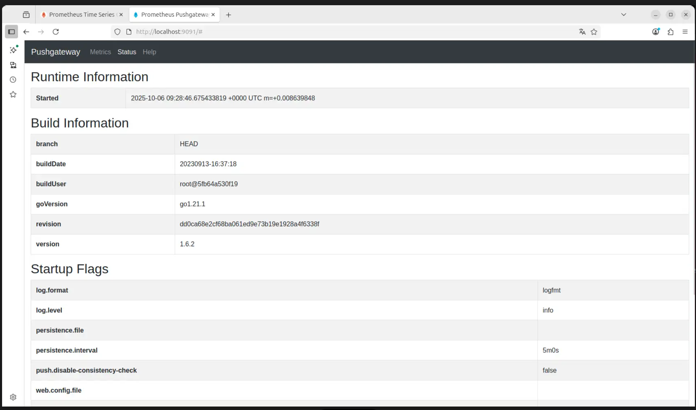
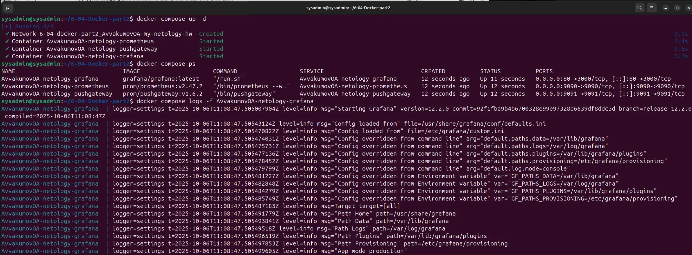
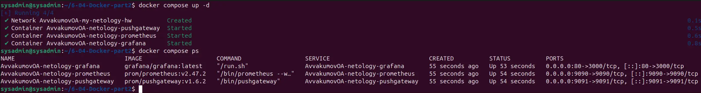
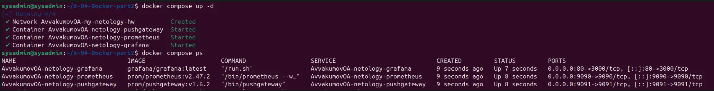
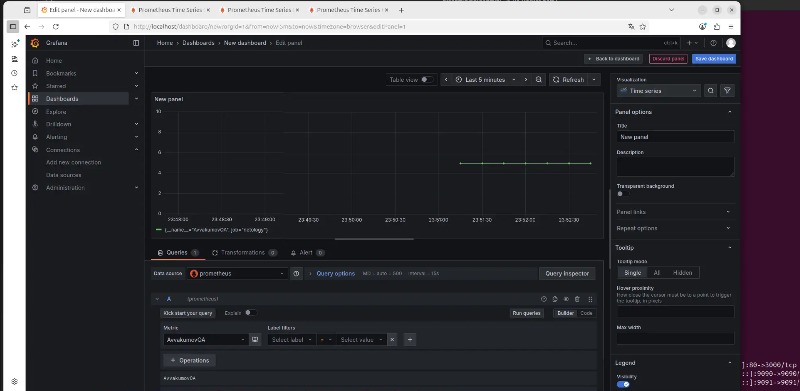
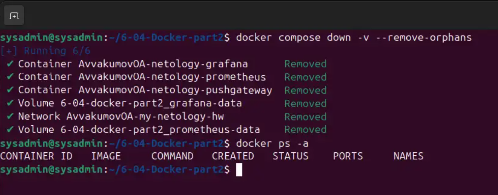

# Домашнее задание к занятию "`Docker. Часть 2`" - `Аввакумов Олег`


### Задание 1

`Приведите ответ в свободной форме.......`

Docker Compose — это инструмент, который позволяет запускать и управлять несколькими контейнерами Docker как единым приложением с помощью одного файла конфигурации (обычно docker-compose.yml). Вместо того чтобы вручную запускать отдельные контейнеры для базы данных, веб-сервера и других сервисов, я просто пишу один файл и командой docker-compose up поднимаю всё окружение целиком. Это сильно упрощает разработку: не нужно каждый раз настраивать зависимости, всё изолировано, легко воспроизводится на другом компьютере, и я не боюсь «сломать» основную систему. Лично мне это экономит кучу времени и нервов — особенно когда нужно быстро протестировать идею или развернуть локально полноценное приложение.




---

### Задание 2

```
version: "3.8"

services: {}
  
  
volumes: {}

networks:
  AvvakumovOA-my-netology-hw:
    driver: bridge
    ipam:
      config:
        - subnet: 10.5.0.0/16
          gateway: 10.5.0.1
```


---

### Задание 3

`docker-compose.yml`
```
version: "3.8"

services:
  AvvakumovOA-netology-prometheus:
    image: prom/prometheus:v2.47.2
    container_name: AvvakumovOA-netology-prometheus
    command: --config.file=/etc/prometheus/prometheus.yml --storage.tsdb.path=/prometheus
    ports:
      - "9090:9090"             # внешний доступ с докер-сервера
    volumes:
      - /home/sysadmin/6-04-Docker-part2/6-04/prometheus:/etc/prometheus:ro  # конфиг из репо
      - prometheus-data:/prometheus                                          # данные TSDB
    networks:
      - AvvakumovOA-my-netology-hw
    restart: unless-stopped

volumes:
  prometheus-data:

networks:
  AvvakumovOA-my-netology-hw:
    driver: bridge
    ipam:
      config:
        - subnet: 10.5.0.0/16
          gateway: 10.5.0.1
```

`prometheus.yml`
```
global:
  scrape_interval: 15s
scrape_configs:
  - job_name: "prometheus"
    static_configs:
      - targets: ["localhost:9090"]
```



---

### Задание 4

`docker-compose.yml`

```
services:
  AvvakumovOA-netology-prometheus:
    image: prom/prometheus:v2.47.2
    container_name: AvvakumovOA-netology-prometheus
    command: --web.enable-lifecycle --config.file=/etc/prometheus/prometheus.yml --storage.tsdb.path=/prometheus
    ports:
      - "9090:9090"                 # внешний доступ с докер-сервера
    volumes:
      - /home/sysadmin/6-04-Docker-part2/6-04/prometheus:/etc/prometheus:ro  # конфиг из репо
      - prometheus-data:/prometheus           # данные TSDB
    networks:
      - AvvakumovOA-my-netology-hw
    restart: unless-stopped

  AvvakumovOA-netology-pushgateway:
    image: prom/pushgateway:v1.6.2
    container_name: AvvakumovOA-netology-pushgateway
    ports:
      - "9091:9091"                       # внешний доступ с докер-сервера
    networks:
      AvvakumovOA-my-netology-hw:
        aliases:
          - pushgateway                   
    restart: unless-stopped

volumes:
  prometheus-data:

networks:
  AvvakumovOA-my-netology-hw:
    driver: bridge
    ipam:
      config:
        - subnet: 10.5.0.0/16
          gateway: 10.5.0.1
```

`prometheus.yml`
```
global:
  scrape_interval: 15s
scrape_configs:
  - job_name: "prometheus"
    static_configs:
      - targets: ["localhost:9090"]
  - job_name: "pushgateway"
    honor_labels: true
    static_configs:
      - targets: ["pushgateway:9091"]  
```






---

### Задание 5

`docker-compose.yml`
```
services:
  services:
  AvvakumovOA-netology-grafana:
    image: grafana/grafana:latest
    container_name: AvvakumovOA-netology-grafana
    environment:
      GF_PATHS_CONFIG: /etc/grafana/custom.ini
    ports:
      - "80:3000"
    volumes:
      - ./6-04/grafana/custom.ini:/etc/grafana/custom.ini:ro  
      - grafana-data:/var/lib/grafana
    networks:
      - AvvakumovOA-my-netology-hw
    depends_on:
      - AvvakumovOA-netology-prometheus
    restart: unless-stopped

  AvvakumovOA-netology-prometheus:
    image: prom/prometheus:v2.47.2
    container_name: AvvakumovOA-netology-prometheus
    command: --web.enable-lifecycle --config.file=/etc/prometheus/prometheus.yml --storage.tsdb.path=/prometheus
    ports:
      - "9090:9090"                 
    volumes:
      - /home/sysadmin/6-04-Docker-part2/6-04/prometheus:/etc/prometheus:ro  # конфиг из репо
      - prometheus-data:/prometheus           # данные TSDB
    networks:
      - AvvakumovOA-my-netology-hw
    restart: unless-stopped

  AvvakumovOA-netology-pushgateway:
    image: prom/pushgateway:v1.6.2
    container_name: AvvakumovOA-netology-pushgateway
    ports:
      - "9091:9091"                       # внешний доступ с докер-сервера
    networks:
      AvvakumovOA-my-netology-hw:
        aliases:
          - pushgateway                   
    restart: unless-stopped

volumes:
  prometheus-data:
  grafana-data:

networks:
  AvvakumovOA-my-netology-hw:
    driver: bridge
    ipam:
      config:
        - subnet: 10.5.0.0/16
          gateway: 10.5.0.1

```

`custom.ini`
```
[security]
admin_user = AvvakumovOA
admin_password = netology
```




---

### Задание 6
`docker-compose.yml`

```
services:
  AvvakumovOA-netology-pushgateway:
    image: prom/pushgateway:v1.6.2
    container_name: AvvakumovOA-netology-pushgateway
    ports:
      - "9091:9091"
    networks:
      - AvvakumovOA-my-netology-hw
    restart: unless-stopped

  AvvakumovOA-netology-prometheus:
    image: prom/prometheus:v2.47.2
    container_name: AvvakumovOA-netology-prometheus
    command: --web.enable-lifecycle --config.file=/etc/prometheus/prometheus.yml --storage.tsdb.path=/prometheus
    ports:
      - "9090:9090"
    volumes:
      - ./6-04/prometheus:/etc/prometheus:ro
      - prometheus-data:/prometheus
    networks:
      - AvvakumovOA-my-netology-hw
    depends_on:
      AvvakumovOA-netology-pushgateway:
        condition: service_started
    restart: always

  AvvakumovOA-netology-grafana:
    image: grafana/grafana:latest
    container_name: AvvakumovOA-netology-grafana
    environment:
      GF_PATHS_CONFIG: /etc/grafana/custom.ini
    ports:
      - "80:3000"
    volumes:
      - ./6-04/grafana/custom.ini:/etc/grafana/custom.ini:ro
      - grafana-data:/var/lib/grafana
    networks:
      - AvvakumovOA-my-netology-hw
    depends_on:
      AvvakumovOA-netology-prometheus:
        condition: service_started
    restart: unless-stopped

volumes:
  prometheus-data:
  grafana-data:

networks:
  AvvakumovOA-my-netology-hw:
    name: AvvakumovOA-my-netology-hw
    driver: bridge
    ipam:
      config:
        - subnet: 10.5.0.0/16
          gateway: 10.5.0.1
```



---


### Задание 7

`docker-compose.yml`


```
services:
  AvvakumovOA-netology-pushgateway:
    image: prom/pushgateway:v1.6.2
    container_name: AvvakumovOA-netology-pushgateway
    ports:
      - "9091:9091"
    networks:
      AvvakumovOA-my-netology-hw:
        aliases:
          - pushgateway         
    restart: unless-stopped

  AvvakumovOA-netology-prometheus:
    image: prom/prometheus:v2.47.2
    container_name: AvvakumovOA-netology-prometheus
    command: >
      --web.enable-lifecycle
      --config.file=/etc/prometheus/prometheus.yml
      --storage.tsdb.path=/prometheus
      --storage.tsdb.retention.time=1d           
    ports:
      - "9090:9090"
    volumes:
      - ./6-04/prometheus:/etc/prometheus:ro
      - prometheus-data:/prometheus
    networks:
      AvvakumovOA-my-netology-hw:
        aliases:
          - prometheus          
    depends_on:
      AvvakumovOA-netology-pushgateway:
        condition: service_started
    restart: always

  AvvakumovOA-netology-grafana:
    image: grafana/grafana:latest
    container_name: AvvakumovOA-netology-grafana
    environment:
      GF_PATHS_CONFIG: /etc/grafana/custom.ini
    ports:
      - "80:3000"
    volumes:
      - ./6-04/grafana/custom.ini:/etc/grafana/custom.ini:ro
      - grafana-data:/var/lib/grafana
    networks:
      - AvvakumovOA-my-netology-hw
    depends_on:
      AvvakumovOA-netology-prometheus:
        condition: service_started
    restart: unless-stopped

volumes:
  prometheus-data:
  grafana-data:

networks:
  AvvakumovOA-my-netology-hw:
    name: AvvakumovOA-my-netology-hw
    driver: bridge
    ipam:
      config:
        - subnet: 10.5.0.0/16
          gateway: 10.5.0.1

```




---

### Задание 8




